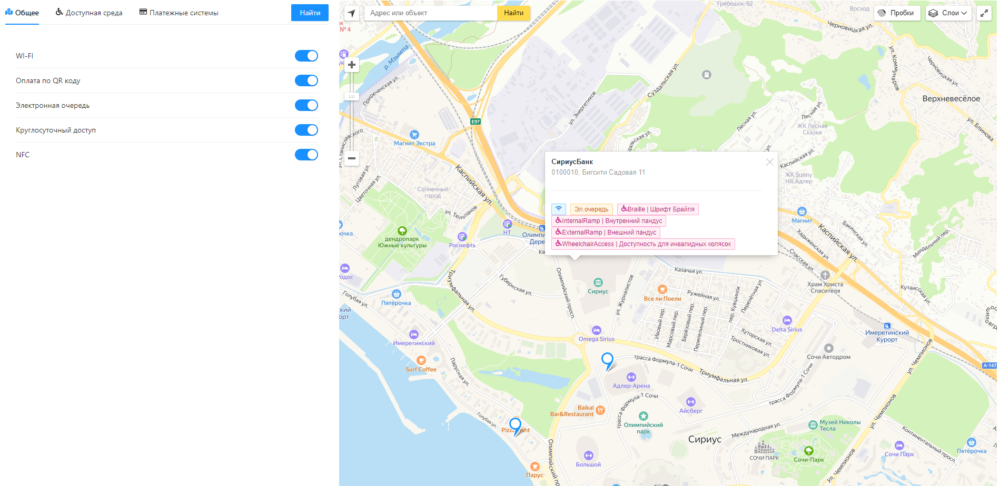
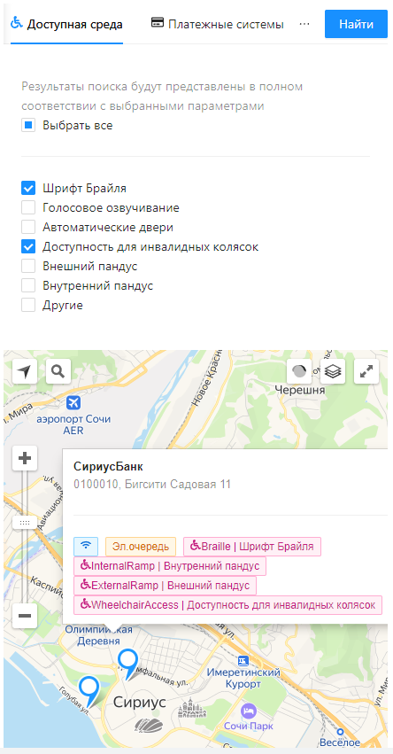

# Бизнес-кейс «Передача информации по счетам клиента в процессе онлайн-кредитования»

Решение кейса в рамках программы университета Сириус «ОТКРЫТЫЕ API» совместно с партнером «ФИНТЕХ ХАБ БАНКА РОССИИ»

## Описание кейса

### **Проблема**

Клиент, физическое лицо, приезжая в другую страну хочет знать месторасположение ближайшего банкомата или филиала банка иностранного государства, предоставляющего наиболее выгодные условия для него (например, для обмена валюты).

Онлайн-карты предоставляют не всегда актуальную информацию и не учитывают индивидуальные особенности клиента с точки зрения финансовых сервисов.

### **Предполагаемое решение**

Предоставление сведение по филиалам банков и банкоматам через Открытые API в приложение банка клиента с актуальной информацией и индивидуальными условиями позволит повысить удобство клиента.

Для этого банкииностранного государства, выступая в роли ППУ, предоставляют сведения по своим банкоматам и филиалам, а банки, обслуживающие клиента,выступая в роли СПИУ, демонстрируют сведения по банкоматам и филиалам клиенту.

### **Задачи**

- Подготовить презентационный доклад на защиту бизнес-кейса, в котором:
  - описать преимуществаи выгоды от реализациибизнес-кейса;
  - описать клиентский путь;
  - определить границы MVP;
  - описать бизнес-процесс передачи данных из одной компании в другую.
- Сформировать техническую спецификацию, описывающую процесс передачи данных, модели данных и конечные точки.
- Разработать программное обеспечение в соответствии с технической спецификацией и продемонстрировать его работу.

### **Участники бизнес-процесса**

- Финтех-компания – потребитель данных или **сторонний поставщик данных** (СПИУ)
- Банк – **поставщик данных** (ППУ)
- Физическое лицо (ФЛ)

### **Ожидаемая польза**

Повышение удобства для конечного потребителя, находящегося за рубежомза счет автоматизации обмена информацией по банкоматам и филиалам банков между банками.

[Исходный текст кейса](README/5_Волков%20Передача%20информации%20по%20банкоматам%20и%20филиалам.pdf)

## Описание решения

Общая схема решения


1. На основе стандартов Банка России был составлен [документ](maps.yaml) OPEN API спецификации.
2. Далее, используя документ спецификации, с помощью кодогенерации был создан [сервер](nodejs-server-server-generated/) имитирующий банк. Его REST API интерфейсы передают информацию о банкоматах и офисах.
3. Далее был разработан собственный [сервер](backend/) (стороннего поставщика данных), который отсылал запросы к банковскому серверу (поставщику данных). У сервера есть свое WEB API уже нерегламентированное стандартами. Кроме того на сервере присутствует бизнес логика фильтрующая банкоматы и офисы по пользовательскому запросу.
4. [Пользовательское приложение](frontend/) отображает карту и ряд фильтров. Отсылает запросы только стороннему поставщику данных.

Диаграмма последовательности


## Внешний вид приложения

Использовались:
- [Ant Design](https://ant.design/) - библиотека компонентов пользовательского интерфейса React 
- [React Yandex Maps](https://react-yandex-maps.vercel.app/) - обертка над Yandex.Maps API для React
  
Главная и единственная страница приложения



Вид мобильной версии



## Запуск

Запустить можно все вместе командой `docker-compose up --build -d` или запустить каждый компонент по отдельности.

1. Запуск NodeJS сервера
   
   ```console
    cd nodejs-server-server-generated
    npm start
   ```
2. Запуск .NET сервера
   
   ```console
    cd backend
    dotnet run
   ```
3. Запуск React приложения
   
   ```console
   cd frontend
   npm start
   ```

## Команда

- <a href="https://t.me/amoniaka_knabino" target="_blank">Иванова Светлана</a>
- <a href="https://t.me/ryusupova" target="_blank">Юсупова Рамиля</a>
- <a href="https://t.me/D_Korr" target="_blank">Кориненко Даниил</a>
- <a href="https://t.me/sside1" target="_blank">Волков Александр</a>
- <a href="https://t.me/volandy_kzt" target="_blank">Волков Андрей</a> - ментор

## Ссылки

- <a href="https://sochisirius.ru/" target="_blank">Сайт Сириуса</a>
- <a href="https://www.cbr.ru/fintech/fin_hub/" target="_blank">Сайт Финтех хаба Банка России</a>
- <a href="https://sochisirius.ru/obuchenie/graduate/smena1144/5532" target="_blank">Страница программы «ОТКРЫТЫЕ API»</a>
- <a href="http://www.cbr.ru/StaticHtml/File/59420/Standart_08072021.pdf" target="_blank">Открытые банковские интерфейсы. Получение публичной информации о банке и его продуктах</a>
- <a href="http://www.cbr.ru/StaticHtml/File/59420/standart_1.pdf" target="_blank">Открытые банковские интерфейсы. Общие положения</a>
- <a href="https://github.com/OAI/OpenAPI-Specification" target="_blank">OpenAPI Specification</a>
